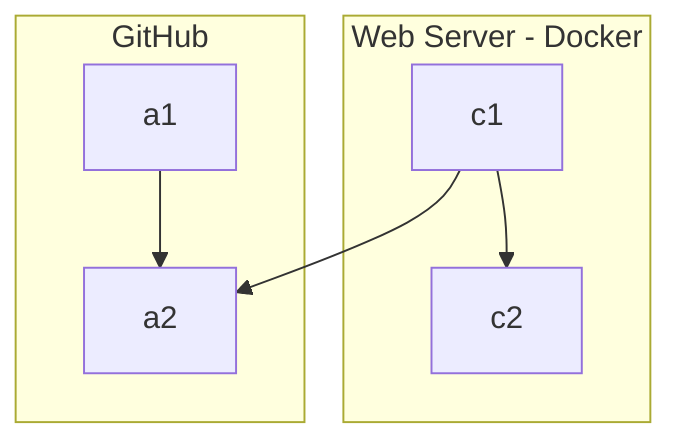

# nullinside-development-group

This organization is primarily responsible for the code required to run https://nullinside.com and its ancillary
applications.

## Architecture

```mermaid
flowchart TB
    c1-->a2
    subgraph Web Server - Docker
    c1-->c2
    end
    subgraph GitHub
    a1-->a2
    end
```