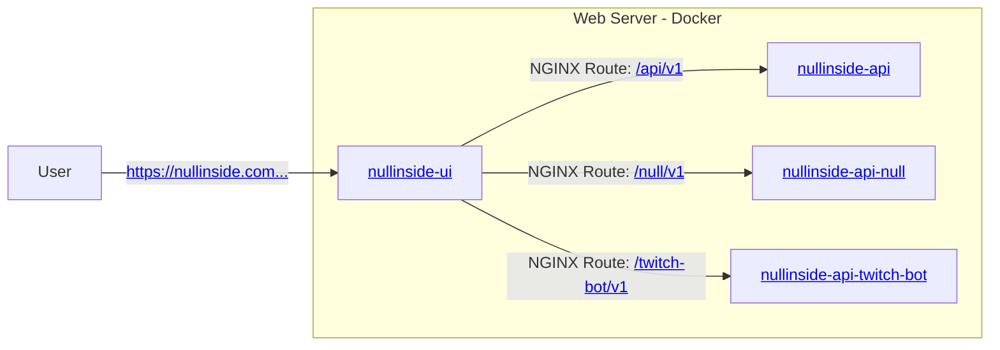
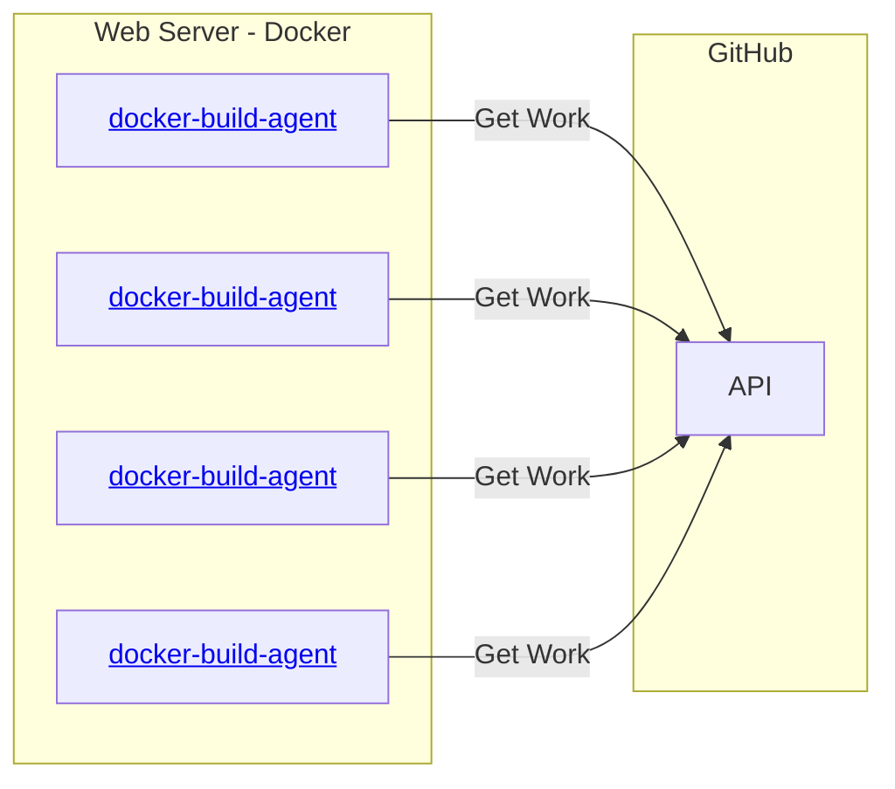
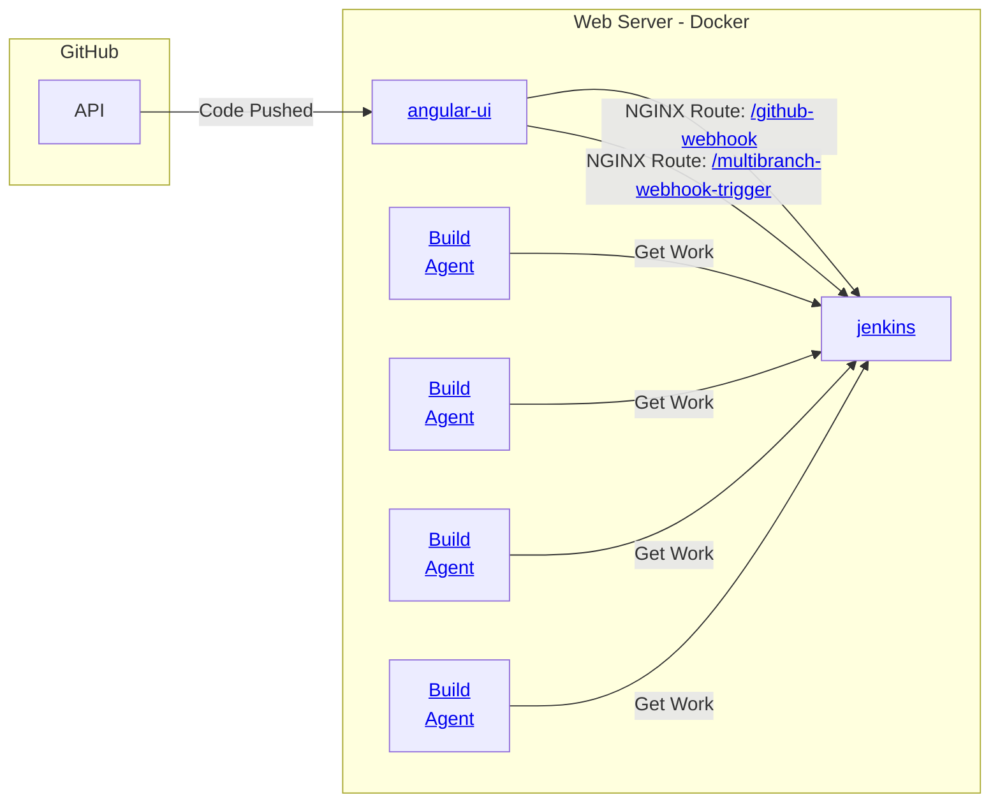

# nullinside-development-group

This organization is primarily responsible for the code required to run https://nullinside.com and its ancillary
applications.

<!-- TOC -->
* [nullinside-development-group](#nullinside-development-group)
  * [Site](#site)
  * [Code Bases](#code-bases)
  * [CICD](#cicd)
    * [Pull Request Testing](#pull-request-testing)
    * [Code Building](#code-building)
<!-- TOC -->

## Site

The DNS for [nullinside.com](https://nullinside.com) points to the address of the web server hosting the site and
its microservices. The NGINX server configured in the [nullinside-ui](https://github.com/nullinside-development-group/nullinside-ui)
project listens for all incoming web requests and routes to individual microservices based on the requested URI. The
[nullinside-ui](https://github.com/nullinside-development-group/nullinside-ui) project also hosts the code responsible
for generating the `index.html` file for the site.

The site hosts "proof of ownership" files at [https://nullinside.com/.wellknown/acme-challenge](https://github.com/nullinside-development-group/nullinside-ui/tree/main/nginx/filesystem/usr/share/nginx/html/.well-known/acme-challenge)
for its site certificate provided by [Lets Encrypt](https://letsencrypt.org/).

## Code Bases

1. **Templates:** Templates used when creating new git repos to create boilerplate code for applications.
   * [nullinside-template-desktop-gui](https://github.com/nullinside-development-group/nullinside-template-desktop-gui): A
     standard desktop application written in C# using Avalonia. Deploys application as a GitHub release. Includes code
     for checking for new releases of the application. 
2. **Website:** The codebases that explicitly support HTTP responses for (nullinside.com)[https://nullinside.com].
   * [nullinside-ui](https://github.com/nullinside-development-group/nullinside-ui): The frontend website UI. It also
     stands up the NGINX server.
   * [nullinside-api](https://github.com/nullinside-development-group/nullinside-api): The open source API that supports
     the site.
   * [nullinside-api-null](https://github.com/nullinside-development-group/nullinside-api-null): The closed source API
     that supports the site.
   * [nullinside-api-twitch-bot](https://github.com/nullinside-development-group/nullinside-api-twitch-bot): The
     [Twitch.tv](https://twitch.tv) chatbot and the webservice used to configure it.
3. **Ancillary:** The ancillary applications that support the site or its sister deliverables.
   * [nullinside-site-monitor](https://github.com/nullinside-development-group/nullinside-site-monitor): A desktop
     application that monitors the site and its microservices to ensure they are online.
   * [nullinside-cicd-github](https://github.com/nullinside-development-group/nullinside-cicd-github): Automation for
     dealing with missing functionality from out-of-the-box GitHub.   

## CICD

### Pull Request Testing

All pull requests are tested prior to be merged using GitHub actions that run on self-hosted runners. These checks,
where possible, include CodeQL in addition to common sense sanity tests on the proposed code.

### Code Building

Code is built on Jenkins using self-hosted runners. The jenkins instance has two publicly exposed endpoints that ingest
JSON data indicating when updates are made to the GitHub codebase. Updates to each codebase's `main` branch
automatically triggers builds and deploys artifacts.

