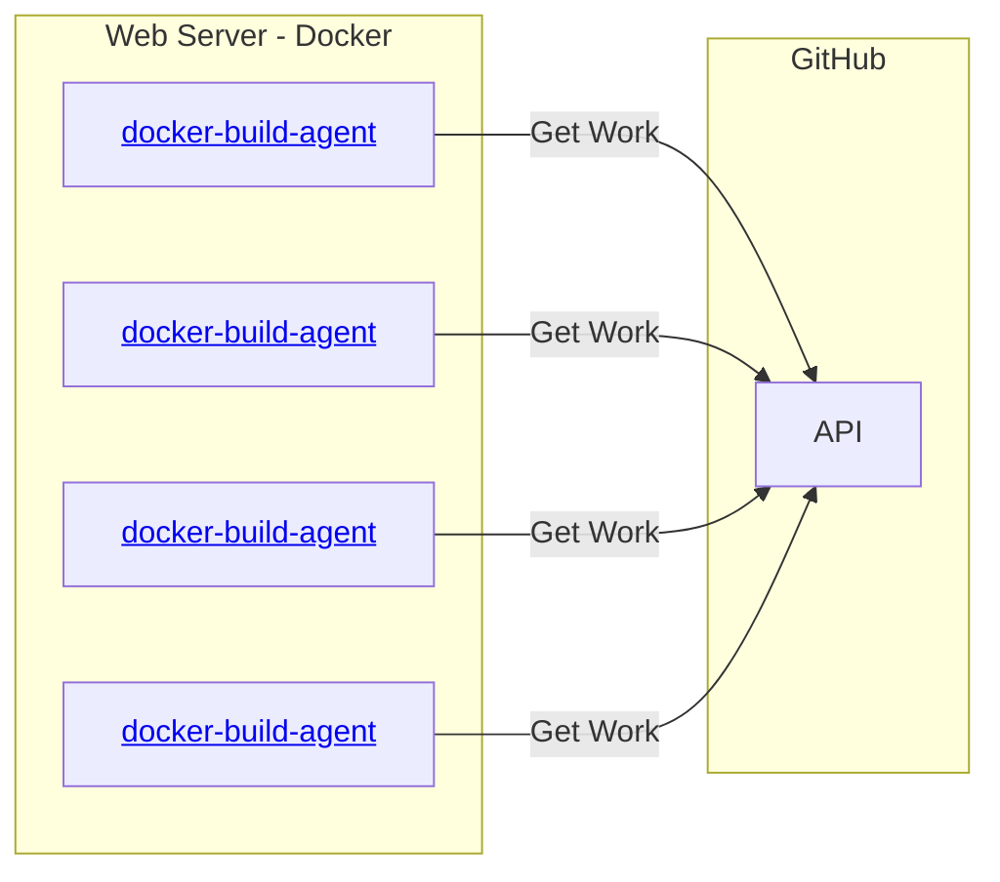
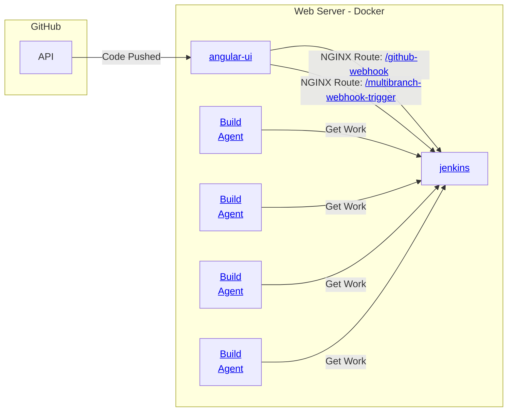

# nullinside-development-group

This organization is primarily responsible for the code required to run https://nullinside.com and its ancillary
applications.

## Architecture

### CICD

#### Pull Request Testing

All pull requests are tested prior to be merged using GitHub actions that run on self-hosted runners. These checks,
where possible, include CodeQL in addition to common sense sanity tests on the proposed code.

#### Code Building

Code is built on Jenkins using self-hosted runners. The jenkins instance has two publicly exposed endpoints that ingest
JSON data indicating when updates are made to the GitHub codebase. Updates to each codebase's `main` branch
automatically triggers builds and deploys artifacts.

